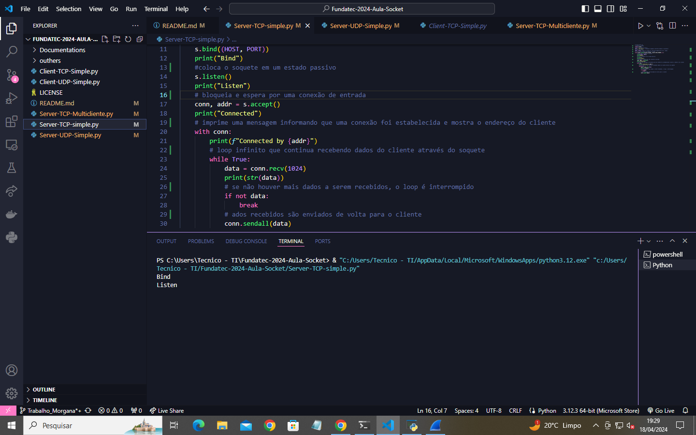

# Trabalho socket

Estes sockets fazem parte das aulas de redes de computadores!
Enjoy meus alunos!

Alunos!!!
***
## Sobre o trabalho
Documente com print e coloque aqui as respostas

### Simple server TCP :

1) Subir o tcp server simple explicar os estados da conexão, bind, listen etc.
 

Bind: É uma função que associa um endereço IP e número de porta a um socket, permitindo que ele receba pacotes enviados para esse endereço e porta específicos.

Listen: É uma função que marca um socket como passivo, permitindo que ele aceite conexões de entrada. Após chamá-la, o socket está pronto para receber conexões de clientes.
***
2) Executar o programa de cliente simple server tcp e verificar os estados da conexão.
 
***
3) Analise o código fonte
```python
 #echo-server.py
 importa o socket
 import socket
 #passa um endereço de ip
HOST = "127.0.0.1"  # Standard loopback interface address (localhost)
 #Número da porta
PORT = 65432  # Port to listen on (non-privileged ports are > 1023)
 #cria um novo objeto de soquete e o tipo
with socket.socket(socket.AF_INET, socket.SOCK_STREAM) as s:
    # Vinculado ao endereço e porta 
    s.bind((HOST, PORT))
    print("Bind")
     #coloca o soquete em um estado passivo
    s.listen()
    print("Listen")
     #bloqueia e espera por uma conexão de entrada
    conn, addr = s.accept()
    print("Connected")
     #imprime uma mensagem informando que uma conexão foi estabelecida e mostra o endereço do cliente
    with conn:
        print(f"Connected by {addr}")
         #loop infinito que continua recebendo dados do cliente através do soquete
        while True:
            data = conn.recv(1024)
            print(str(data))
             #se não houver mais dados a serem recebidos, o loop é interrompido
            if not data:
                break
             #dados recebidos são enviados de volta para o cliente
            conn.sendall(data)
```
***
4) Analise usando o wireshark explicando os pacotes.
 
***
5) Diferencie a conexão UDP de TCP
   
TCP =
Tipo de conexão: Requer uma conexão estabelecida antes de transmitir dados.
Sequência de dados: Pode sequenciar dados, permitindo enviar um pedido específico.
Retransmissão de dados: Pode retransmitir dados caso os pacotes não cheguem ao destino.
Entrega: A entrega é garantida, garantindo que todos os dados cheguem ao destino na ordem correta.
Verificação de erros: Realiza uma verificação minuciosa de erros para garantir que os dados cheguem em seu estado pretendido.
Difusão: Não é compatível com difusão.

UDP=
Tipo de conexão: Nenhuma conexão é necessária para iniciar e terminar uma transferência de dados.
Sequência de dados: Não pode sequenciar ou organizar os dados, eles são transmitidos na ordem em que foram enviados.
Retransmissão de dados: Não há retransmissão de dados. Dados perdidos não podem ser recuperados.
Entrega: A entrega não é garantida, o que significa que alguns dados podem ser perdidos durante a transmissão.
Verificação de erros: Realiza uma verificação mínima de erros, cobrindo o básico, mas pode não impedir todos os erros.
Difusão: Compatível com difusão, permitindo enviar pacotes para todos os dispositivos em uma rede local.
***
### Simple server UDP :

1) Subir o tcp server simple explicar os estados da conexão, bind, listen etc.
 
***
2) Executar o programa de cliente simple server tcp e verificar os estados da conexão.
 
***
3) Analise o código fonte
``` phyton
import socketserver

class MyUDPHandler(socketserver.BaseRequestHandler):
    """
    This class works similar to the TCP handler class, except that
    self.request consists of a pair of data and client socket, and since
    there is no connection the client address must be given explicitly
    when sending data back via sendto().
    """

    def handle(self):
        # recebe os dados e o soquete do cliente
        data = self.request[0].strip() #obtém dados
        socket = self.request[1] #obtém o soquete
        # imprime o endereço IP do cliente e os dados recebidos
        print("{} wrote:".format(self.client_address[0]))
        print(data)
        # envia os dados de volta para o cliente   
        socket.sendto(data.upper(), self.client_address)
# configura o servidor UDP para executar no HOST e PORT 
if __name__ == "__main__":
    HOST, PORT = "localhost", 65431
    with socketserver.UDPServer((HOST, PORT), MyUDPHandler) as server:
          # inicia o servidor para sempre 
        server.serve_forever()
```
***
4) Analise usando o wireshark explicando os pacotes.
 
***

### Multiserver TCP :
1) Subir o tcp server simple explicar os estados da conexão, bind, listen etc.
  
***
2) Executar o programa de cliente simple server tcp e verificar os estados da conexão.
 
***
3) Analise o código fonte
 ```python
import socketserver


class MyTCPHandler(socketserver.BaseRequestHandler):
    """
    The RequestHandler class for our server.

    It is instantiated once per connection to the server, and must
    override the handle() method to implement communication to the
    client.
  
   def handle(self):
        # self.request é o soquete TCP conectado ao cliente
        self.data = self.request.recv(1024).strip()  # Recebe os dados do cliente
        print("{} escreveu:".format(self.client_address[0]))
        print(self.data)
        # Envia de volta os mesmos dados, mas em maiúsculas
        self.request.sendall(self.data.upper())

if __name__ == "__main__":
    HOST, PORT = "localhost", 65432

    # Cria o servidor, vinculando ao localhost na porta especificada
    server = socketserver.TCPServer((HOST, PORT), MyTCPHandler)

    # Ativa o servidor; isso continuará em execução até você
    # interromper o programa com Ctrl-C
    server.timeout = 10  # Define um tempo limite de 10 segundos
    server.serve_forever()  # Inicia o servidor para sempre ou até ser interrompido
```
***
4) Analise usando o wireshark explicando os pacotes.
 
 ***
5) Explique as diferenças de multi conexões e porque a cada conexão a porta "muda". Demonstre a mudança de porta usando o Wireshark
   
Cada conexão TCP ou UDP é identificada por um par único de endereços IP e números de porta, conhecidos como "tupla de endereço". Quando ocorrem múltiplas conexões em um mesmo servidor, cada conexão precisa ter uma identificação única, e isso é feito através da combinação do endereço IP e número de porta de origem do cliente com o endereço IP e número de porta de destino do servidor.
Conexão multipla:
 
Conexão UDP:
 
***
### Conexão com máquina remota do colega :

1) Subir o tcp server na máquina do colega, verificar o IP da máquina (certifique que ele esteja na mesma rede que você)
   Meu =
  
  Colega =
   
   ***
3) Executar o programa cliente na sua máquina, não esqueça de modificar o IP para a máquina do seu colega.
 
***
3) Demonstre com imagens que a conexão teve sucesso.
    
***
4) Usando wireshark mostra conexão filtrando pela portas.
 
